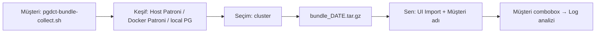

# Bundle collector — müşteri paketi ve import

## Akış özeti



## 1) Müşteriye gönder

```bash
make bundle-collector-dist
# → dist/pgdct-bundle-collector.tar.gz
```

Müşteri talimatı:

```bash
tar xzf pgdct-bundle-collector.tar.gz && cd pgdct-bundle-collector
chmod +x pgdct-bundle-collect.sh
./pgdct-bundle-collect.sh
```

Script otomatik tarar (öncelik sırası):

1. **Host Patroni (standart, non-Docker)** — `http://127.0.0.1:8008/cluster`
2. **Docker Patroni** — container içinden `/cluster`
3. **Local PostgreSQL** — `pg_isready` / `psql` varsa (tek node, host logları)

Host Patroni çok node ise collector peer node'lara SSH ile bağlanmayı dener.

Liste gelir, numara seçer (veya `-y` ile ilki). Çıktı: **`bundle_YYYYMMDDTHHMMSSZ.tar.gz`**

### Müşteri komutları

| Komut | Anlamı |
|--------|--------|
| `./pgdct-bundle-collect.sh` | Keşif + interaktif seçim + toplama |
| `./pgdct-bundle-collect.sh --discover` | Sadece ortamları listele |
| `./pgdct-bundle-collect.sh -y` | İlk ortamı otomatik seç |
| `./pgdct-bundle-collect.sh --pick 2` | 2. ortamı seç |
| `./pgdct-bundle-collect.sh -c config.yaml` | Manuel config (keşif yok) |
| `./pgdct-bundle-collect.sh --sources postgres,os` | Kaynakları zorla (auto’yu ezer) |

**Kaynaklar (auto):** Standalone / Patroni unit yok → **postgres, os** only. Docker veya host Patroni → **patroni, postgres, etcd, os**. `--sources` verilirse auto devre dışı.

**PostgreSQL log keşfi (postgres kaynağı):** sırayla dener — `journalctl` (`postgresql`, `postgresql-16`, `postgresql@*` unit’leri), `psql` ile `SHOW log_directory` / `log_filename`, bilinen dizinler (`/var/log/postgresql`, RHEL `/var/lib/pgsql/...`), `config.yaml` içindeki `postgres_log_paths`, toplama sırasında interaktif custom path.

## 2) Sen import et (PG-DCT UI)

1. **Bundles** → **Import customer bundle**
2. **Müşteri adı** (zorunlu) — örn. `Acme Bank`
3. `.tar.gz` seç → **Import**
4. Cluster adı bundle içindeki **Patroni scope**’undan okunur (`bc-pg-main` vb.)
5. Mesajda **log başlangıç → bitiş** tarihleri görünür

## 3) Müşteri combobox

Import sonrası **Müşteri seç** listesinde müşteri görünür.

- Müşteri seç → **Logları aç** → Lets Check Logs’ta o müşterinin en son bundle’ı yüklenir
- Snapshot tablosunda müşteriye göre filtre

## API

```bash
# Import
curl -X POST http://127.0.0.1:8080/api/v1/bundles/import \
  -F "customer_name=Acme Bank" \
  -F "file=@bundle_20260527T171109Z.tar.gz"

# Müşteri listesi
curl -s http://127.0.0.1:8080/api/v1/bundles/customers

# Müşteriye göre bundle'lar
curl -s "http://127.0.0.1:8080/api/v1/bundles?customer_name=Acme%20Bank"
```

## Gereksinimler (müşteri)

- Python 3.10+
- Standart Patroni kurulumunda: hosttan `curl http://127.0.0.1:8008/cluster`
- Çok node Host Patroni için: peer node'lara SSH erişimi (opsiyonel `ssh_hosts` map)
- Docker modu için: Docker + `docker exec` erişimi
